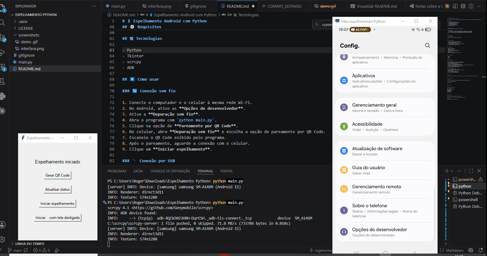

# 📱 Espelhamento Android com Python

Aplicação para controlar o espelhamento de dispositivos Android no Windows utilizando **Python**, **scrcpy** e **ADB**. 

## 📑 Índice

- [🎬 Demonstração](#-demonstração)
- [✨ Funcionalidades](#-funcionalidades)
- [⚙️ Requisitos](#-requisitos)
- [🛠️ Tecnologias](#-tecnologias)
- [▶️ Como usar](#-como-usar)
- [🚀 Como executar](#-como-executar)
- [📄 Licença](#-licença)

---

 
---

## 🎬 Demonstração

<p align="center">
  
</p>
<p align="center">
  
  
  
</p>

---

## ✨ Funcionalidades

- 📱 Detecta dispositivos Android conectados
- 📶 Permite pareamento sem fio via QR Code
- 🖥️ Inicia o espelhamento da tela
- 🔒 Permite espelhar com a tela do celular desligada
- ⚠️ Exibe mensagens de erro e status
- 🖱️ Interface gráfica simples em Tkinter

---

## ⚙️ Requisitos

- Windows 10 ou superior
- Python 3.10 ou superior
- Celular Android
- ADB e scrcpy instalados na pasta `C:\scrcpy`
### 📶 Para conexão sem fio
- Computador e celular conectados à mesma rede Wi-Fi
- Depuração sem fio ativada no Android
### 🔌 Para conexão USB
- Cabo USB
- Depuração USB ativada

---

## 🛠 Tecnologias

- Python
- Tkinter
- scrcpy
- ADB

## ▶️ Como usar

### 📶 Conexão sem fio

1. Conecte o computador e o celular à mesma rede Wi-Fi.
2. No Android, ative as **Opções do desenvolvedor**.
3. Ative a **Depuração sem fio**.
4. Abra o programa com `python main.py`.
5. Clique na opção de **Pareamento por QR Code**.
6. No celular, abra **Depuração sem fio** e escolha a opção de pareamento por QR Code.
7. Escaneie o QR Code exibido pelo programa.
8. Após o pareamento, aguarde a conexão com o celular.
9. Clique em **Iniciar espelhamento**.

### 🔌 Conexão por USB

1. Ative a **Depuração USB** no Android.
2. Conecte o celular ao computador usando um cabo USB.
3. Abra o programa.
4. Autorize a depuração USB no celular.
5. Clique em **Verificar celular**.
6. Clique em **Iniciar espelhamento**.

---

## 📄 Licença

Este projeto está licenciado sob a licença MIT. Consulte o arquivo `LICENSE` para mais informações.

---

## 🚀 Como instalar

```bash
git clone https://github.com/rogerunlock-cmd/python-android-mirroring.git

cd python-android-mirroring

python main.py
```

---

## 📂 Estrutura

```
python-android-mirroring/
│
├── screenshots/
│   └── interface.png
├── main.py
├── README.md
├── LICENSE
└── .gitignore
```

---

## 👨‍💻 Autor

Desenvolvido por **Roger Belchior Marcilio**

Se este projeto foi útil para vc deixe uma⭐no repositório!

GitHub:
https://github.com/rogerunloock-cmd