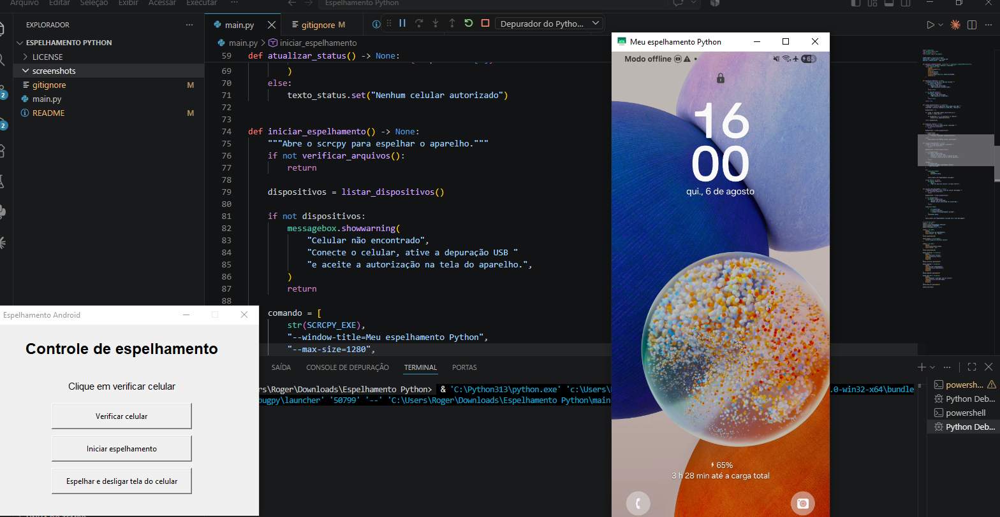

# 📱 Espelhamento Android com Python

<p align="center">

Aplicação para controlar o espelhamento de dispositivos Android no Windows utilizando **Python**, **scrcpy** e **ADB**.

</p>

<p align="center">
  
</p>

<p align="center">
  
  
  
</p>

---

## ✨ Funcionalidades

- 📱 Detecta dispositivos Android conectados
- 🖥️ Inicia o espelhamento da tela
- 🔒 Permite espelhar com a tela do celular desligada
- ⚠️ Exibe mensagens de erro e status
- 🖱️ Interface gráfica simples em Tkinter

---

## 🛠 Tecnologias

- Python
- Tkinter
- scrcpy
- Android Debug Bridge (ADB)

---

## 📋 Requisitos

- Windows 10 ou superior
- Python 3.10+
- scrcpy instalado
- Depuração USB ativada

---

## 🚀 Como executar

```bash
git clone https://github.com/rogerunlock-cmd/python-android-mirroring.git

cd python-android-mirroring

python main.py
```

---

## 📂 Estrutura

```
python-android-mirroring/
│
├── screenshots/
│   └── interface.png
├── main.py
├── README.md
├── LICENSE
└── .gitignore
```

---

## 👨‍💻 Autor

**Roger Belchior Marcilio**

GitHub:
https://github.com/rogerunlock-cmd